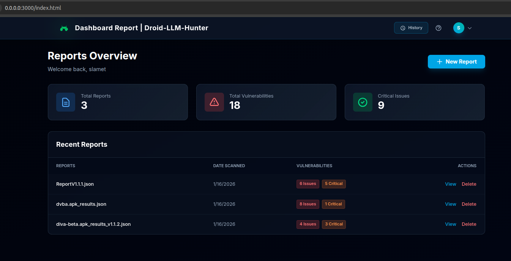

# Dashboard Report | Droid-LLM-Hunter

<p align="center">
  
  
</p>

**Dashboard Report Droid-LLM-Hunter** is a specialized web interface designed to visualize and manage security analysis reports generated by the Droid-LLM-Hunter tool. It transforms raw JSON output into an interactive, easy-to-read dashboard, helping security researchers and developers identify and remediate vulnerabilities in Android applications efficiently.

<p align="center">
  
</p>

## Features

*   **📊 Interactive Overview**: Get a high-level view of your application's security posture with dynamic charts and statistics (Severity Distribution, Vulnerability Status).
*   **📂 Project Management**: A centralized hub to manage multiple scan reports. View history, track progress, and organize your security audits.
*   **🔍 Detailed Findings**: Explore vulnerabilities with rich details, including severity levels, descriptions, evidence, attack scenarios, and remediation recommendations.
*   **🗺️ Attack Surface Map**: Visualize the application's attack surface to understand potential entry points.
*   **🔐 User System**: Secure authentication system (Login/Register) to protect your reports.
*   **📱 Responsive Design**: Modern, dark-themed UI built with Tailwind CSS for a comfortable viewing experience on any device.

## Tech Stack

*   **Frontend**: HTML5, Tailwind CSS, JavaScript (Vanilla), Chart.js
*   **Backend**: Node.js, Express.js
*   **Database**: SQLite (Lightweight, serverless)
*   **Authentication**: Passport.js (JWT Strategy)

## Installation

### Prerequisites
*   [Node.js](https://nodejs.org/) (v14 or higher)
*   [npm](https://www.npmjs.com/) (Node Package Manager)

### Steps

1.  **Clone the Repository**
    ```bash
    git clone https://github.com/roomkangali/dashboard-report-dlh.git
    cd dlh-dashboard
    ```

2.  **Install Dependencies**
    ```bash
    npm install
    ```

3.  **Start the Server**
    ```bash
    npm start
    ```
    *Alternatively, run:* `node server.js`

4.  **Access the Dashboard**
    Open your web browser and navigate to:
    ```
    http://localhost:3000
    ```
    *(Note: If running on a server, use server's IP address, e.g., `http://192.168.1.x:3000`)*

## 📖 Usage Guide

1.  **Register/Login**: Create a new account or log in to access the dashboard.
2.  **Dashboard Home**: You will see an overview of all your projects.
3.  **New Scan**: Click the **"New Scan"** button to start.
4.  **Upload Report**: Drag and drop your `.json` report file generated by Droid-LLM-Hunter.
5.  **Analyze**:
    *   **Overview Tab**: Charts and stats.
    *   **Findings Tab**: Detailed list of vulnerabilities. Filter by severity (Critical, High, etc.).
    *   **App Summary**: General information about the analyzed app.
    *   **Attack Surface**: Map of exported components and potential risks.

